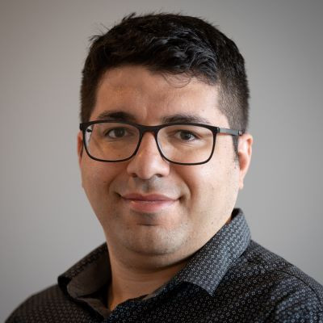

<table>
<tr>
<td width="160px" valign="top">
  
</td>
<td>

# **Sam Abdollahi**  
**Photonic Chip Designer**  
📍 Richmond Hill, ON, Canada  
📧 [abdollahi.siamak@gmail.com](mailto:abdollahi.siamak@gmail.com)  
📞 +1 (418) 569-3946  

</td>
</tr>
</table>

---

## 🔍 About Me

Experienced photonic chip designer with a strong background in CMOS behavior, analog/RF design, and computational EM. Over 12 successful silicon photonic tape-outs, deep simulation expertise, and multiple patents in photonics and electronics. Currently Staff Analog Designer at Synopsys and founder of EasyFDTD.

---

## 💼 Work Experience

**Staff Analog Designer**  
*Synopsys Inc. – Toronto, Canada (2024–Present)*  
- Architected and simulated novel SerDes systems.  
- Oversaw layout and verification for advanced analog blocks.

**Sr. Application Engineer**  
*Lorentz Solution Inc. – Remote (2022–2024)*  
- Created foundry tech files and automation for EM simulation (Peakview).  
- Developed scalable de-embedding models (up to 150 GHz).

**Sr. Photonic IC Designer**  
*Xanadu Quantum – Toronto, ON (2021–Present)*  
- Designed PIN diode modulators, CMOS drivers, and quantum PICs.  

... *(see full CV for more)*

---

## 🎓 Education

**PhD, Electrical Engineering – Photonics**  
*University of Alberta*  
*Thesis: Nonlinear Dynamics of Coupled Micro-Ring Resonators*

**MSc, Electrical Engineering – Semiconductor Devices**  
*Tarbiat Modares University*  
*Thesis: Heat Generation in SOI Waveguides*

**BSc, Electrical Engineering – Electronics**  
*K.N. Toosi University of Technology*  
*Thesis: Free-Space Optical Link for Data Transfer*

---

## 🧪 Patents

- **US20240114235A1** – High-frequency photonic packaging  
- **63/634,250** – Modular Power Station + UPS  
- **63/703,908** – Cascade De-Embedding for mmWave Lines  
🔗 [Google Patents](https://patents.google.com/?inventor=Siamak+Abdollahi)

---

## 📝 Publications

- *Applied Optics*, *Optics Letters*, *IEEE PTL*, *JOSA B*  
- Topics: Nonlinear silicon photonics, resonators, wavelength converters

---

## 🛠️ Tools & Skills

- **Simulation**: COMSOL, Lumerical, Meep, ADS  
- **Layout**: Cadence Virtuoso, IPKISS, Klayout  
- **Languages**: Python, C++, Matlab, Shell  
- **Tools**: Git, Linux, HSPICE, Protel  

---

## 👨‍💼 Founder – EasyFDTD

- Inventor of portable dual-function UPS + solar power station.  
- Leading product development, patent filing, and commercialization.  
- Focus on energy solutions for mobile, off-grid, and smart systems.

---

> ⚙️ *Full CV available upon request or in repository.*
